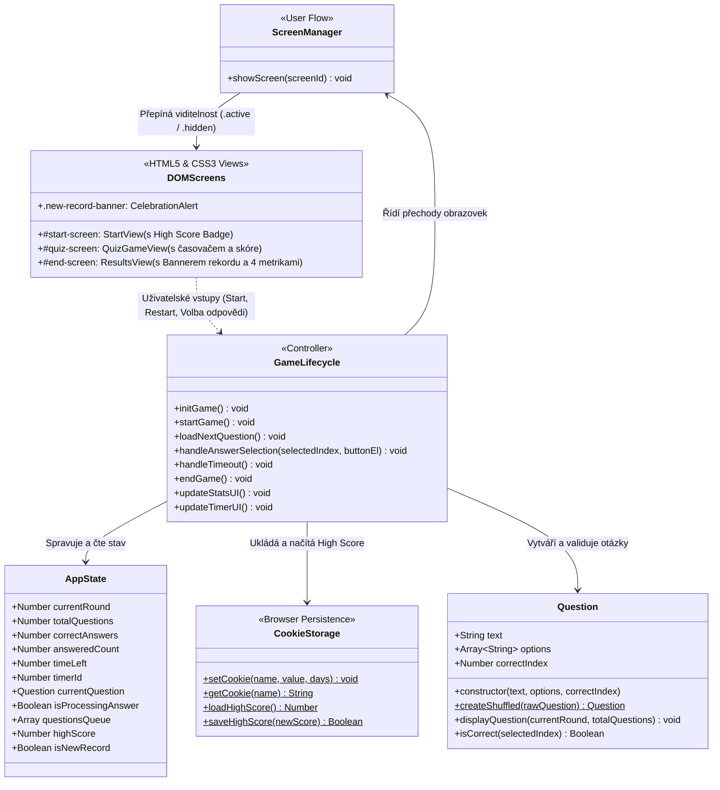

# 🧠 QuizApp v4 Pro: Trvalá Data, Persistence a Finální Produkt

Výuková interaktivní webová kvízová aplikace zaměřená na trvalé ukládání dat v prohlížeči (Persistence) pomocí **JavaScript Cookies API**, sledování a ukládání nejvyššího osobního skóre (**High Score**), detekci a oslavnou animaci nového rekordu, víceobrazovkovou architekturu (**User Flow**) a kompletní **produkční refaktoring** s vyladěním designu z Figmy.

Tato verze představuje **4. finální fázi (produkční vydání s trvalým ukládáním dat)**, která dokončuje vývojový cyklus aplikace a připravuje ji jako plnohodnotný, komerčně hodnotný webový produkt.

---

## 🎯 Klíčová témata a výukové cíle

* **Trvalá data a JavaScript Cookies API (Browser Persistence)**:
  * Práce s vlastností [`document.cookie`](script.js:37).
  * Vytvoření robustních pomocných funkcí [`setCookie(name, value, days)`](script.js:37) a [`getCookie(name)`](script.js:52).
  * Správné kódování parametrů pomocí [`encodeURIComponent()`](script.js:41) a [`decodeURIComponent()`](script.js:60).
  * Moderní bezpečnostní standardy: nastavení `path=/` a ochrany proti CSRF `SameSite=Lax`.
* **Logika osobního rekordu (High Score Tracking)**:
  * Načtení uloženého rekordu při startu aplikace v [`initGame()`](script.js:235) z cookie `quiz_highscore`.
  * Zobrazení rekordu na úvodní obrazovce ([`#start-highscore-container`](index.html:94)), v herním statistikách i v závěrečném vyhodnocení.
  * Porovnání aktuálního skóre s uloženým rekordem v [`endGame()`](script.js:283) a automatický zápis nového maxima.
* **Vizuální oslava a mikrainterakce**:
  * Oslavný banner a animace při překonání osobního rekordu ([`#new-record-banner`](index.html:180) s třídou `.new-record-banner`).
  * Zlaté akcenty, pulzující světelné efekty (`box-shadow: 0 0 20px var(--color-gold-glow)`) a rotace ikon.
* **Produkční refaktoring a kvalita kódu (Code Cleanliness)**:
  * Odstranění všech ladicích `console.log()` výpisů z produkční verze.
  * Ošetření hraničních stavů (první návštěva bez existující cookie, neplatné číselné hodnoty).
  * Důsledné dodržování konvencí pojmenování proměnných a funkcí (camelCase, UPPER_SNAKE_CASE).
* **Figma Design System & Responzivita**:
  * Centralizované CSS proměnné (`:root`), responzivní 4sloupcová mřížka výsledků, přístupnost (A11y, ARIA atributy).

---

## 📐 Architektura Aplikace (UML Diagram)



---

## 🧩 Struktura Projektu

```text
quiz-app-v4-pro/
├── index.html            # Vstupní stránka s odznáčkem High Score, 3 obrazovkami a bannerem rekordu
├── styles.css            # Produkční referenční styly (Figma design, zlaté efekty rekordu, animace)
├── styles-students.css   # Pracovní studentská verze stylů s TODO úkoly pro odznak rekordu a banner
├── script.js             # Produkční referenční JS (Cookies API, ukládání rekordu, čistý kód)
├── script-students.js    # Pracovní studentská verze JS s nápovědou pro setCookie/getCookie a High Score
├── LICENSE               # Plný text licence GNU AGPL-3.0
├── README.md             # Tento didaktický průvodce s architekturou a návodem
└── docs/                 # Výukové podklady a taháky
    ├── quiz-app-v4-pro.md
    └── JS_Cookies_produkcni_refaktoring_tahak.md
```

---

## 🚀 Jak s projektem pracovat

### 1. Spuštění referenční aplikace
1. Otevřete soubor [`index.html`](index.html) v moderním webovém prohlížeči (např. přes rozšíření *Live Server* ve VS Code).
2. Na úvodní obrazovce si všimněte odznáčku **Osobní rekord 🏆** (při prvním spuštění ukazuje 0 bodů).
3. Klikněte na **Spustit kvíz 🚀** a odehrajte 5 otázek.
4. Pokud dosáhnete alespoň 1 bodu, na závěrečné obrazovce se zobrazí oslavný banner **Nový osobní rekord! 🎉** a skóre se trvale uloží do cookies.
5. Obnovte stránku v prohlížeči (klávesou `F5`) – váš osobní rekord zůstává bezpečně zachován!

### 2. Přepnutí na studentskou pracovní verzi
V souboru [`index.html`](index.html) přepněte komentáře odkazů:

* **Pro styly** v sekci `<head>`:
  ```html
  <!-- <link rel="stylesheet" href="styles.css"> -->
  <link rel="stylesheet" href="styles-students.css">
  ```
* **Pro skript** před koncem `</body>`:
  ```html
  <!-- <script src="script.js"></script> -->
  <script src="script-students.js"></script>
  ```
* Postupujte podle číslovaných úkolů `TODO 1` až `TODO 3` v souboru [`styles-students.css`](styles-students.css) a `TODO 1` až `TODO 6` v souboru [`script-students.js`](script-students.js).

---

## 🎯 Co se student naučí

1. **Ukládat trvalá data v prohlížeči (Cookies Persistence)**: Pochopí syntaxi `document.cookie`, práci s časovou expirací (`expires`, `max-age`), cesty (`path=/`) a bezpečnostní atribut `SameSite=Lax`.
2. **Vytvářet opakovaně použitelné pomocné funkce (Utility Functions)**: Naprogramuje obecné funkce [`setCookie()`](script.js:37) a [`getCookie()`](script.js:52) s ošetřením speciálních znaků pomocí [`encodeURIComponent()`](script.js:41).
3. **Spravovat herní rekord (High Score Lifecycle)**: Naučí se načítat uložený stav při startu aplikace, synchronizovat data s UI a detekovat okamžik překonání rekordu.
4. **Vytvářet atraktivní mikrointerakce a oslavné stavy**: Pomocí CSS animací (`@keyframes bounceIn`, `recordGlow`) a dynamických CSS tříd vytvoří působivý vizuální zážitek pro uživatele.
5. **Aplikovat produkční refaktoring**: Osvojí si návyk čistit kód od testovacích výpisů, strukturovat aplikace do logických modulů a ošetřovat nevalidní vstupy.

---

## ⚙️ Použité technologie & Požadavky

* **HTML5**: Sémantické sekce (`<section>`, `<article>`, `<header>`, `<main>`, `<footer>`), ARIA atributy pro přístupnost (`aria-live="polite"`).
* **CSS3**: CSS Custom Properties (`var(--...)`), Flexbox & Grid rozvržení, pokročilé přechody a animace (`@keyframes`, gradienty, světelné stíny `box-shadow`).
* **JavaScript**: ECMAScript 2020+ (Cookies API, Třídy, Arrow functions, Spread syntax, bezpečné parsování stringů).
* **Podporované prohlížeče**: Všechny moderní webové prohlížeče (Google Chrome, Mozilla Firefox, Microsoft Edge, Safari). Nevyžaduje žádné externí npm závislosti.

---

## 👤 Autor a Licencování

**Autor:** Jakub Březa (Vlk samotář) – [VlkSamotar.cz](https://vlksamotar.cz) | Informatika | Trading | Elektrotechnika 

---

## 📜 Licence & Komerční využití

Tento projekt je šířen pod licencí **GNU Affero General Public License v3 (AGPL-3.0)** (viz přiložený soubor [LICENSE](LICENSE)).

### Co to znamená?
* **Pro studenty a samouky:** Projekt můžete volně používat, studovat a upravovat pro své osobní účely.
* **Pro lektory a vzdělávací organizace:** Můžete projekt využít při výuce, ale **pokud aplikaci (nebo její upravenou verzi) provozujete na síti/webu, musíte zachovat zdrojový kód otevřený pod stejnou licencí AGPL-3.0** a uvést původního autora.

### 💼 Máte zájem o komerční využití bez omezení AGPL?
Pokud chcete tento interaktivní playground integrovat do své komerční (uzavřené) platformy, e-learningu nebo máte zájem o white-label řešení pro vaši školu, kontaktujte mě na [VlkSamotar.cz](https://vlksamotar.cz) pro sjednání **komerční proprietární licence**.

---

## 🧩 Třetí strany a závislosti

* **Google Fonts (Lexend, Roboto)**: Šířeno pod otevřenou licencí [SIL Open Font License 1.1](https://openfontlicense.org/).
* Projekt je čistě nativní bez nutnosti instalace dalších runtime knihoven.
